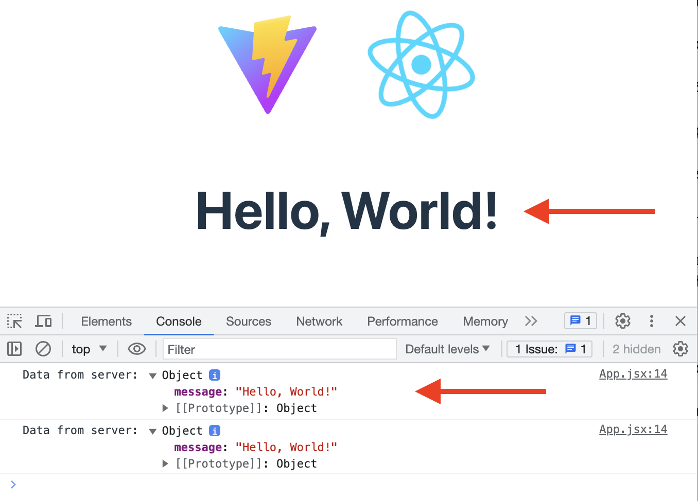

# GameFuze

A full stack JavaScript solo project for game enthusiasts to view top rated games!

## Why GameFuze?

As a new developer, I wanted to build an application that took both of interests in programming and video games to combine the two together.

## Technologies Used

- React.js
- Bootstrap 5
- Node.js
- PostgresQL
- Express
- HTML5
- CSS3
- AWS Elastic Beanstalk

## Live Demo

Try the application at [http://final-project-dev2.us-west-1.elasticbeanstalk.com/login]

## Features 

- View the top rated games per (RAWG API community).
- View game details of a specific game.
- Create an accoun† to save your list of games.
- Add your favorite game to a wishlist

### Coming Soon!

- Search through the RAWG API.
- Find out which stores are carrying your wishlisted games.
- Leave your personal review for your favorite games.

### Getting Started

1. Clone the repository
2. Install all dependencies with `npm install`.
3. Create the database
   - Start PostgresQL
   - Create Database (replace `name-of-database` with a name of your choosing).
   - In your `server/.env` file, update the names of your environment variables if needed.
4. Start all development servers with `'dev'` script.

### RAWG API

- Information and how to acquire an API key can be found here [https://rawg.io/apidocs]
- 20,000 calls per period
- Free to use!
- Remember to attribute RAWG where appropriate within your application

#### Verify the client

1. A React app has been created for you.
1. Take a minute to look over the code in `client/src/App.jsx`
1. Go to the app in your browser. You should see the message from the server below the React logo, and in the browser console.
   
1. If you see the message from the server in your browser you are good to go, your client and server are communicating.

#### Set up the database

1. In your browser navigate to the site you used for your database design.
1. Export your database as PostgreSQL, this should generate the SQL code for creating your database tables.
1. Copy the generated SQL code and paste it into `database/schema.sql` below the preexisting sql code in the file. The end result should look something like: _(You will likely have more tables)_

   ```SQL
   set client_min_messages to warning;

   -- DANGER: this is NOT how to do it in the real world.
   -- `drop schema` INSTANTLY ERASES EVERYTHING.
   drop schema "public" cascade;

   create schema "public";

   create table "public"."todos" (
       "todoId"      serial,
       "task"        text           not null,
       "isCompleted" boolean        not null,
       "createdAt"   timestamptz(6) not null default now(),
       "updatedAt"   timestamptz(6) not null default now(),
       primary key ("todoId")
   );
   ```

   - **NOTE:** Database design websites do not do a perfect job of generating SQL, so you may need to make some adjustments to your SQL for it to work correctly. In particular, if using DbDesigner, make sure the double quotes around `"public"."table"` are correct.

1. In a separate terminal, run `npm run db:import` to create your tables
1. Use `pgweb` (at `localhost:8081`) to verify your tables were created successfully
1. In `pgweb` you should see your database and tables.
1. At this point your database is setup and you are good to start using it. However there is no data in your database, which isn't necessarily a bad thing, but if you want some starting data in your database you need to add insert statements into the `database/data.sql` file. You can add whatever starting data you need/want. Here is an example:
   ```SQL
   insert into "todos" ("task", "isCompleted")
   values
       ('Learn to code', false),
       ('Build projects', false),
       ('Get a job', false);
   ```
1. After any changes to `database/schema.sql` or `database/data.sql` re-run the `npm run db:import` command to update your database. Use `pgweb` to verify your changes were successfully applied
   

---
